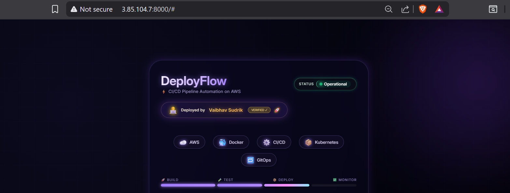
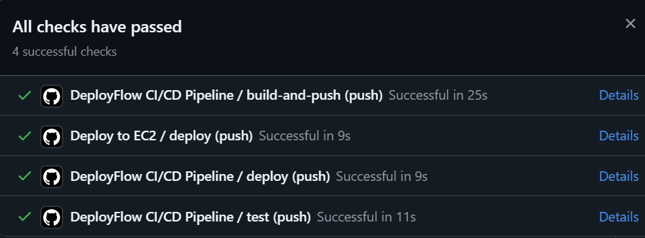
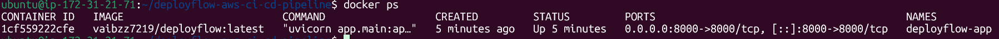
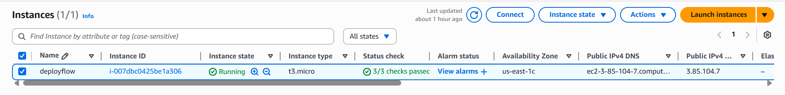

#  DeployFlow — Production CI/CD Pipeline on AWS

A fully automated **CI/CD pipeline** built using **GitHub Actions, Docker, and AWS EC2** to deploy a FastAPI application in a production-like environment.

---

## ⚡ Features

* 🔁 Automated CI/CD pipeline (GitHub Actions)
* 🐳 Dockerized FastAPI application
* ☁️ Deployment on AWS EC2
* 🔐 Secure secrets management (GitHub Secrets)
* 🚀 Auto build → test → push → deploy
* 📦 Zero manual deployment

---

## 🏗️ Tech Stack

* **Backend:** FastAPI (Python)
* **CI/CD:** GitHub Actions
* **Containerization:** Docker
* **Cloud:** AWS EC2
* **Version Control:** Git & GitHub

---

## 🔄 CI/CD Pipeline Flow

```text
Code Push → Test → Build Docker Image → Push to DockerHub → Deploy to EC2
```

---
## 📸 Screenshots

### 🚀 UI


### ⚙️ CI/CD Pipeline


### 🐳 Docker Running


### ☁️ AWS EC2


---

## ⚙️ How It Works

1. Developer pushes code to GitHub
2. GitHub Actions triggers pipeline
3. Runs tests automatically
4. Builds Docker image
5. Pushes image to Docker Hub
6. Connects to EC2 via SSH
7. Pulls latest image and runs container

---

## 🔐 Environment Variables (GitHub Secrets)

Add these in your repo:

* `DOCKER_USERNAME`
* `DOCKER_PASSWORD`
* `EC2_HOST`
* `EC2_USER`
* `EC2_SSH_KEY`

---

## 🐳 Run Locally (Optional)

```bash
git clone https://github.com/vaibhav343343/deployflow-aws-ci-cd-pipeline.git
cd deployflow-aws-ci-cd-pipeline

docker build -t deployflow .
docker run -d -p 8000:8000 deployflow
```

---

## 📁 Project Structure

```bash
.
├── app/
├── .github/workflows/
├── Dockerfile
├── requirements.txt
├── screenshots/
└── README.md
```

---

## 🧠 Learnings

* Real-world CI/CD pipeline setup
* Docker image lifecycle
* AWS EC2 deployment automation
* GitHub Actions workflows

---

## 👨‍💻 Author

**Vaibhav Sudrik**
Cloud Computing Student 🚀

---

## ⭐ Support

If you like this project, give it a ⭐ on GitHub!
